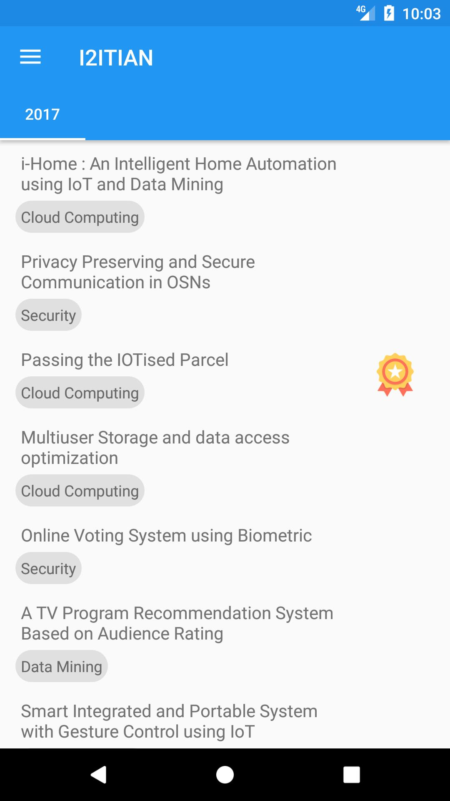

# I2ITIAN
I made this application when I was in my 3rd year of college. I wanted to know what projects others chose and what I would like to make as my engineering project. How were the previous projects rated and who made them. These were the questions I had at the time and I decided to make an app for it. So if anyone else has the same questions, then can use the app and decide for their project ideas.

 1. This application provides I2ITIAN students their Project schedule
    notifications and details of former B.E. Projects.
 2. It utilizes Firebase as back-end.
 3. The application following Google’s Material design guidelines.
 4. It shows the categry and primarry technology of the projects as "pills".
 5. If any project was sponsored, an icon was displayed next to it in the list.
 6. Every final year had its own tab.

